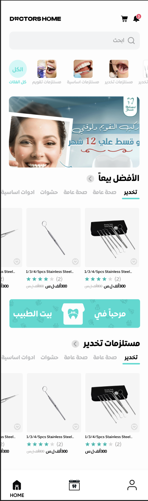
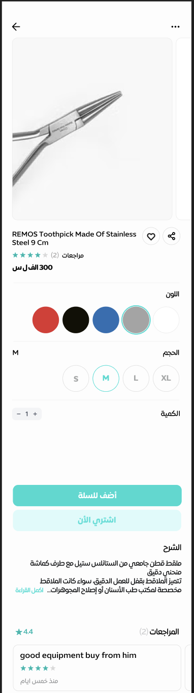
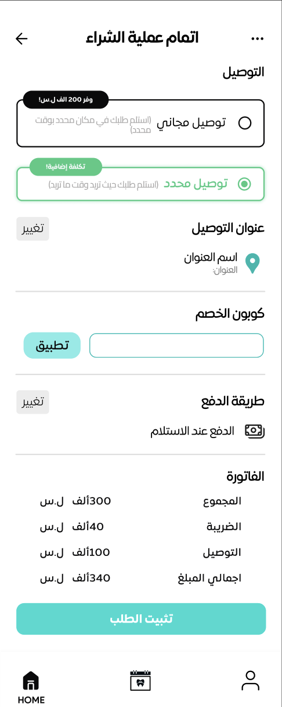
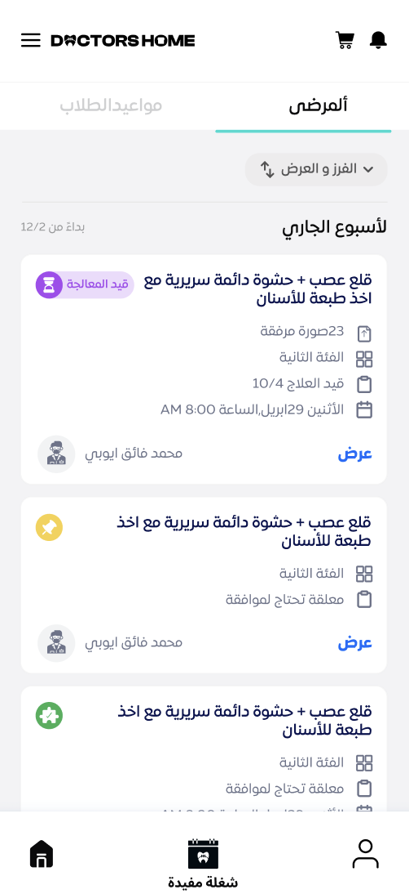
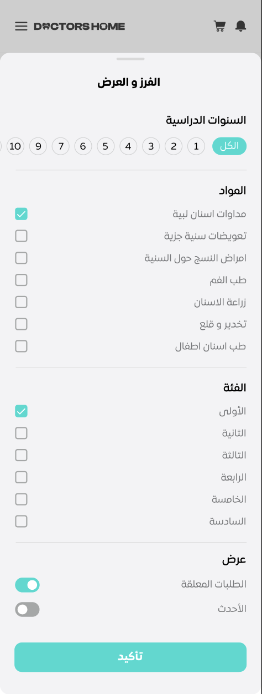
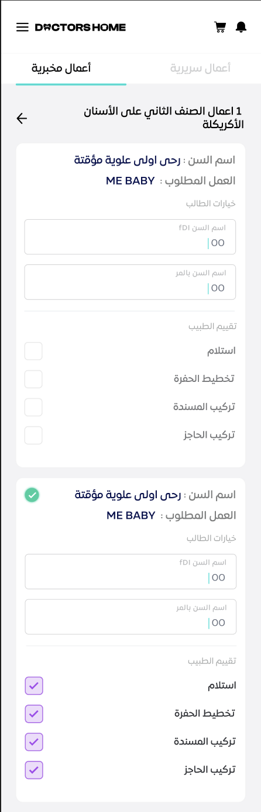
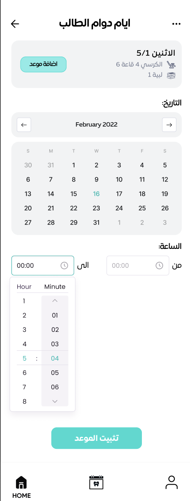

# Doctor's Home 👨‍⚕️🦷

# Description

**_Doctor's Home_** is a dual-part platform designed to assist dental university students. It includes an e-commerce app for purchasing necessary tools for practical subjects and an app to facilitate the process of securing patients for their studies.
Doctor store, is 2 applications project, first one is E-commerce and the other is for University to manage the practical sessions.

## Responsibilites

- Led backend development for Doctor Store, optimizing the e-commerce functionality and patient matching systems.

- Engineered secure authentication mechanisms and implemented efficient algorithms for students management and patient-student matching.

- Developed robust backend systems to facilitate seamless data exchange and automation of difficult and time consuming parts of registering patients for treatment.

- Developed complex system for students to be able to track their weekly subject schedule in their university and manage the subjects they have.

## Used Technologies

- NestJS.
- PostgreSQL
- Redis
- MongoDB
- Sequelize.
- Flutter.

## Some E-commerce App Screenshots
  
  
  

## Some University App Screenshots
  
  
  
  
  
  
  
